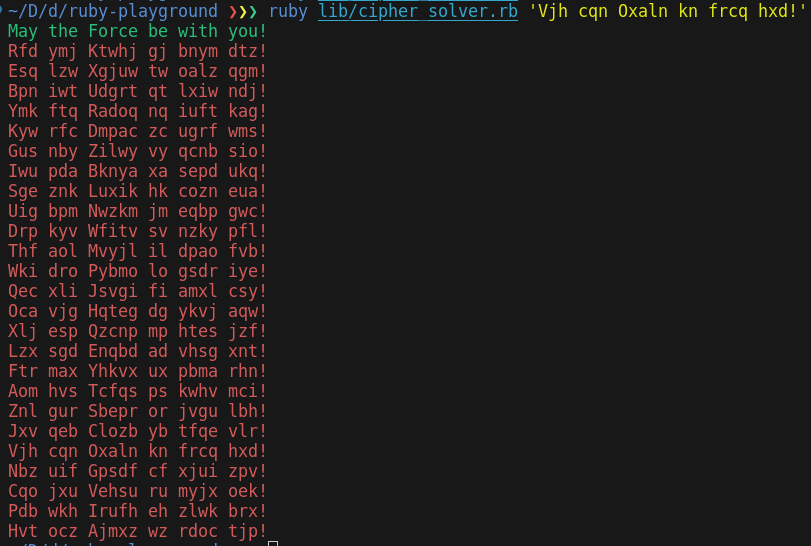

# Ruby Command Line Caesar Cipher Solver

### Description:
A command line program written in Ruby to solve Caesar Ciphers.  
The program generates every possible permutation of the sentence and then sends them to the [DetectLanguage API](https://detectlanguage.com/).  
Results are ranked according to the DetectLanguage API's reported confidence level, and are coloured green if the confidence is above 5 and `isReliable` is true.

I have implied a few rules from the provided example `Vjh cqn Oxaln kn frcq hxd!`:
1. Letter case is maintained (e.g. Z -> A not Z -> a)
2. Any non-alphabetic characters (e.g. spaces, punctuation) are ignored

While developing this I followed the principle of Test Driven Development, using `rspec` to define the required behaviour first and then writing the simplest code required to make the tests pass.

### Usage:  
Must have a DetectLanguage API key configured in the `DETECT_LANGUAGE_KEY` environment variable.  
`bundle install`  
`ruby lib/cipher_solver.rb 'cipher'`

### Output:
